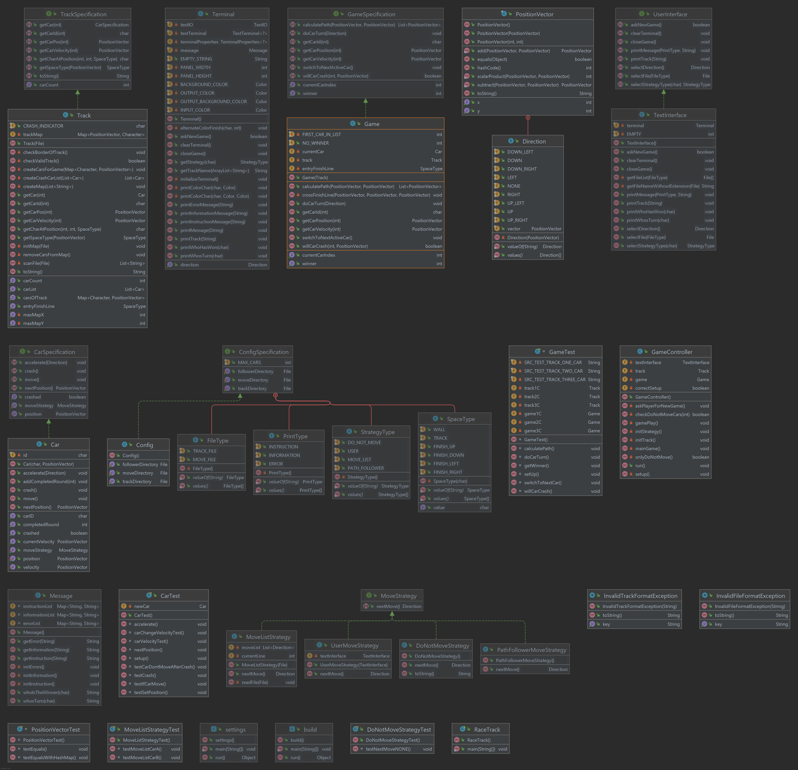
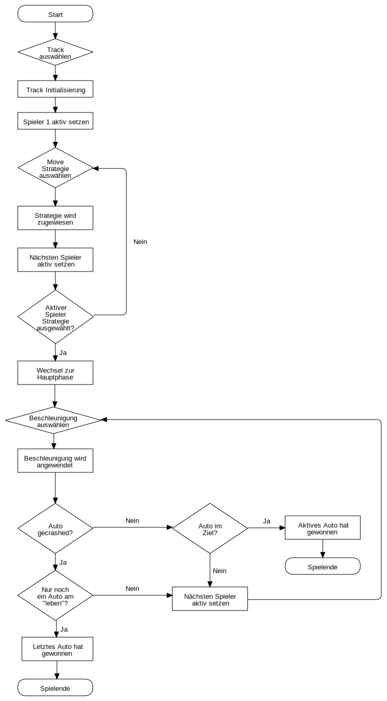

# Gruppe 5 We don't Byte RaceTrack
Dieses Projekt beinhaltet das Spiel RaceTrack als Textvariante.

## Beschreibung

### Regeln
1. Spielfeld
   - Ist ein rechteckiges Raster
   - Umrandet mit einer Wand (**#**)
   - Jedes Autozeichen kommt nur einmal vor
   - Das Auto hat eine möglichen Weg zum Ziel
   - Das Ziellinien-Zeichen ist immer gleich & auf der gesamten Streckenbreite
2. Züge
   - Autos haben eine aktuelle Position & eine Gewschwindigkeit
   - Die Geschwindigkeit zu Beginn ist (0,0)
   - Die Beschleunigung kann auf jeder Achse [-1,0,+1] annehmen
4. Kollisionen
   - Wenn das Auto die Position eines anderen Autos überquert
   - Wenn das Auto die Strecke verlässt (Kollision mit der Wand)
5. Ermittlung des Gewinners
   - Gewinner ist, wer die vorgesehene Strecke in korrekter Richtung absolviert und die Ziellinie erreicht
   - Oder es ist das einzige "überlebende" (noch nicht kollidiert) Auto

### Ablauf
1. Spielvorbereitung
   - Spielfeld (Track) auswählen
   - Jeder Spieler wählt seine Strategie aus
2. Hauptablauf
   - Das erste Auto (resp. nächste Auto) ist am Zug
   - Wählen des Spielzugs
   - Überprüft, ob jemand gewonnen
     * Falls ja, Spiel vorbei. Der aktive Spieler hat gewonnen.
     * Falls nein, ist der nächste Spieler dran.

### Strategie auswählen
| Strategie             | Beschreibung|
|-----------------------| ---|
| 1: Do not move           | Das ausgewählte Auto wird sich während dem ganzen Spiel nicht bewegen.|
| 2: User               | Der Spieler kann jeden Zug für jede Runde wählen.|
| 3: MoveList          | Das Spiel lest eine Liste mit Anweisungen für den Track ein, welche automatisch ausgeführt werden.|

### Branching-Model
Wir haben die Strategie *feature branches* verwendet. Bei dieser Strategie ist die aktuelle stabile Variante auf dem Master-Branch. Bevor ein Stand in den Master kommt, ist der Code im Develop-Branch. In diesem Branch werden die Funktionen getestet, welche ohne Fehler in den Master gepusht werden. Jedes neue Feature bekommt einen neuen Branch, welches nach dessen Entwicklung geschlossen wird.

## Tests
All unsere Test sind in einer Übersicht [hier](docs/tests.md) verfügbar.
Die Tests wurden mit der aktuellen JUnit Version (5) umgesetzt.  

# Diagramme

## Klassendiagramm

Wir haben bei IntelliJ alle Optionen für die Erstellung des Klassendiagramms aktiviert, weil wir dachten, dass ansonsten gegebenenfalls etwas für eine Drittpersonen fehlen könnte, wenn sich diese einlesen will.  
Die Bedeutung der einzelnen Icons kann [hier](https://www.jetbrains.com/help/idea/class-diagram-toolbar-and-context-menu.html#toolbar) gefunden werden.
   
## Flowchart

